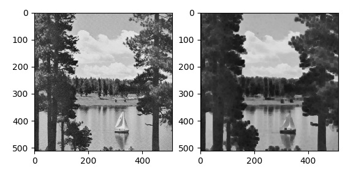
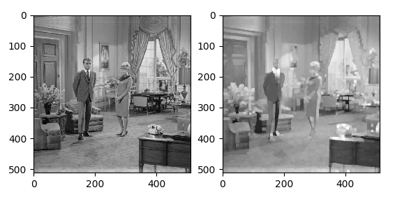
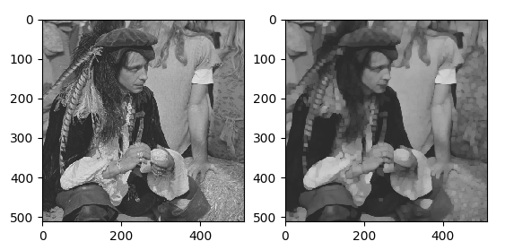
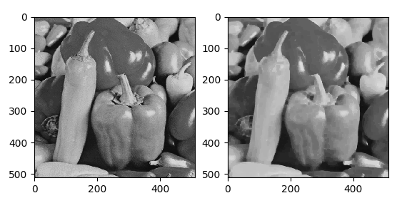
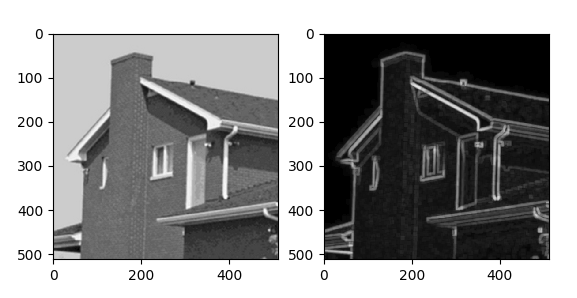
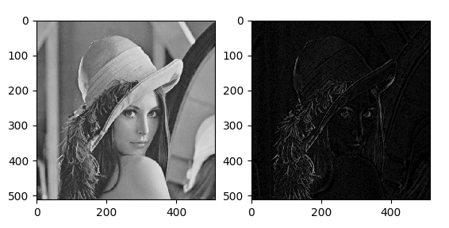

# Filtros Morfológicos

## Autor

| **Nombre y Apellidos** |         **Correo**         |               **GitHub**               |
| :--------------------: | :------------------------: | :------------------------------------: |
|  Ariel Plasencia Díaz  | arielplasencia00@gmail.com | [@ArielXL](https://github.com/ArielXL) |

## Resumen

El objetivo de esta tarea es exponer algunas ideas acerca de la morfología matemática en el procesamiento de imágenes en escala de grises, así como una pequeña comparación entre sus operaciones más importantes. También proponemos nuestra implementación para algunas operaciones morfológicas donde mostramos además, los resultados obtenidos.

### Implementación

La tarea está implementada completamente en [Python 3](https://es.wikipedia.org/wiki/Python). Pensamos que es una implementación legible y fácil de entender donde no hace falta tener conocimientos profundos de este lenguaje de programación. Nos apoyamos fundamentalmente en las librería [numpy](https://numpy.org/doc/stable/), [matplotlib](https://matplotlib.org/stable/tutorials/introductory/usage.html#sphx-glr-tutorials-introductory-usage-py) y [opencv](https://opencv-python-tutroals.readthedocs.io/en/latest/py_tutorials/py_tutorials.html) para la implementación de los algoritmos.

Para la instalación de las mismas ejecutamos el siguiente comando:

```bash
pip install -r requirements.txt
```

### Ejecución

Para ejecutar nuestra propuesta de implementación escribimos:

```bash
cd src/
python main.py
```

## Operaciones morfológicas

### Erosión

* Se define como $A \ominus B$, donde $A$ es la imagen y $B$ el elemento estructurante.

* Colocar sucesivamente el elemento estructurante sobre cada píxel de la imagen $A$.
* Para cada posición, calcule el mínimo valor de $A − B$ teniendo en cuenta los vecinos definidos por $B$.

### Dilatación

* Se define como $A \oplus B$, donde $A$ es la imagen $B$ el elemento estructurante.
* Colocar sucesivamente el elemento estructurante sobre cada píxel de la imagen $A$.
* Para cada posición calcule el máximo valor de $A + B$ teniendo en cuenta los vecinos definidos por $B$.

### Apertura

* Se calcula como $A \circ B = (A \ominus B) \oplus B$, es decir, primero erosión seguida de dilatación.
* Tiende a suprimir regiones pequeñas brillantes dejando el resto de la imagen prácticamente sin
  cambios.

### Cierre

* Se calcula como $A \cdot B = (A \oplus B) \ominus B$, es decir, primero dilatación seguida de erosión.
* Tiende a suprimir pequeñas regiones oscuras.
* Tiende a unir pequeños istmos entre objetos.

### Extracción del contorno

* Se calcula como $A_{p} = A - A \ominus B$.
* Se define como el resultado de erosionar con un elemento estructurante pequeño y el resultado restarlo de $A$.

### Gradiente morfológico

#### Gradiente de Beucher

* Se define como $\rho_{B} = (I \oplus B) - (I \ominus B) = \delta_{B}(f) - \varepsilon_{B}(f)$.

#### Gradiente medio por erosión o gradiente interno

* Se obtiene con la diferencia aritmética entre la imagen original y la imagen erosionada.
* Se define como $\rho_{B}^{-} = I - (I \ominus B) = f - \varepsilon_{B}(f)$.

#### Gradiente medio por dilatación o gradiente externo

* Se define como $\rho_{B}^{+} = (I \oplus B) - I = \delta_{B}(f) - f$.

### Transformación top-hat

* Se calcula como $A - (A \ominus B) \oplus B$.
* Se utiliza para resaltar los elementos individuales.

## Resultados

### Filtro de erosión

### 

### Filtro de dilatación

### 

### Filtro de apertura

### 

### Filtro de cierre

### 

### Filtro del gradiente

### 

### Filtro top-hat

### 

